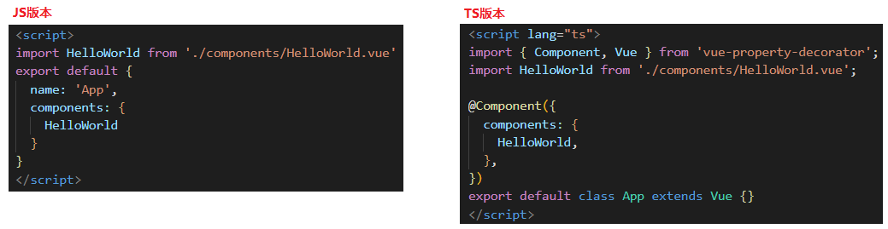

## Vue + TypeScript
### 通过Vue CLI创建一个项目
+ `vue create vue_ts`创建一个名为**vue_ts**的项目
+ `vue add @vue/typescript`修改vue项目，使用typescipt

安装过程中会询问相关配置
```
// 是否使用类的形式编写组件？
? Use class-style component syntax? Yes
// 是否使用 Babel 编译 TypeScript?
? Use Babel alongside TypeScript (required for modern mode, auto-detected polyfills, transpiling JSX)? Yes
// 是否将目前项目中全部的 .js 文件转换成 .ts 文件？
? Convert all .js files to .ts? Yes
// 是否编译构建时将 .ts 编译为 .js 文件？
? Allow .js files to be compiled? Yes
```
### 使用 class-style 创建的组件区别

