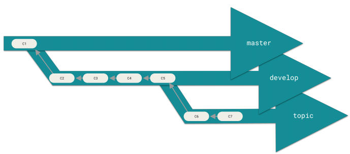
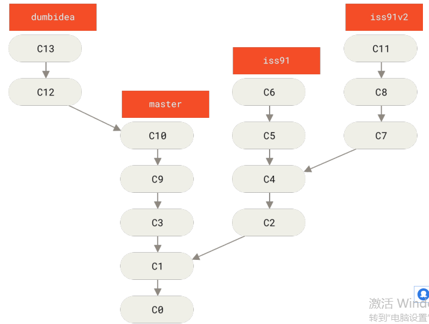
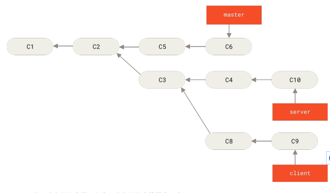

## 第一次安装Git后的配置

**查看`git`配置信息**

`git config --list --show-origin`:查看所有配置以及他们所在的文件

**用户信息**

情况一：个人电脑，关联自己的`Git`仓库

+ `git config --global user.name "your name"`
+ `git config --gloabl user.email your email`

> 注意的是这些配置只需要执行一次，以后的每次提交都会用到这些信息，并且不可修改


情况二：工作，开发的项目的仓库在指定的服务器上（很常用）

一般情况下都是直接`clone`项目下来，自动绑定了远程的仓库以及分支

**当你想针对`特定项目`使用不同的用户名称与邮件地址时，可以`在那个项目目录下`运行`没有 --global` 选项的命令来配置**

+ `git config user.name "your name"`
+ `git config user.email your email`

配置完成可以通过`git config --list`查看配置


## 基础

### 获得一个仓库

一般情况是两种情况，一种是作为项目负责人，搭建项目`从无到有创建一个仓库`，另一种则是开发人员，`使用现有的仓库`。

#### 从无到有

+ 首先进入要管理的目录`cd test_project`(有无文件不重要，有文件就进行初次的提交)
+ 其次初始化这个目录，使其被 Git 管理`git init`

#### 现有仓库

+ 使用`git clone https://xxx.yyy/zzz`此命令将拉去所有的数据，包括历史版本
+ 自定义仓库名称`git clone https://xxx.yyy/zzz another_name`


### 查看状态是个好习惯

`git status`查看管理的文件处于什么状态。

注意：空的文件夹，不会被追踪，如果想记录目录结构可以添加一个占位文件

Untracked:未被跟踪， Unmodified:未改动， Modified:已改动， Stage:已暂存


### 忽略文件

创建一个名为 `.gitignore`的文件，列出要忽略的文件的模式。

```.gitignore
# 这是一行注释
.gitignore
node_modules
# 支持正则
```


### Git add 命令

+ 跟踪新文件
+ 暂存已修改的文件

`git add <files>`:添加一个或多个文件，以空格分开

例如： `git add ./src/main.js ./src/systems/config.js`

`git add <path>`:添加一个路径，递归路径下的所有为本跟踪或已修改的文件

例如： `git add ./src/systems`提交src/systems的   或者`git add ./`提交全部


### Git commit 命令

将**已经暂存**的文件，进行一次提交，生成一次历史记录。

`git commit -m "init repository"`

#### 跳过使用暂存区域

自动把`所有已经跟踪过的`文件暂存起来一并提交，从而跳过 git add 步骤  

`git commit -a -m "ignore git add"`

注意：

+ 提交的是所有的跟踪过的并且修改过了的，因此新增的未被跟踪的不能被提交
+ 所有的，有可能包含不想提交的文件


### 查看提交记录

`git log`会按时间先后顺序列出所有的提交，最近的更新排在最上面。

`git log -p`查看与上次提交的不同，类似`git --diff`

`git log -2`查看最近2次提交。数字就是最近几次

`git log --stat`查看每次提交的简略统计信息（可以跟次数一起使用，例如`git log --stat -2`）

**高级功能**：按条件查询，可参考更多的`git log`参数命令


### 修补提交

修补提交最明显的价值是`可以稍微改进你最后的提交`，而不会让“啊，忘了添加一个文件”或
者“小修补，修正笔误”这种提交信息弄乱你的仓库历史。

`git commit --amend`


### 取消暂存的文件

`git reset HEAD <files>`撤销暂存的文件，也可以省略`HEAD`，它指的是当前的分支。


### 放弃修改

`git checkout -- <files>`对已修改未提交的文件，放弃修改，恢复到上次提交状态。


## 远程仓库

两种情况

+ 远程服务器已存在一个仓库，那么`git clone https://xxx`克隆下来时，自动关联了远程仓库
  + 一般情况克隆下来的项目是没有自己的开发分支的，两种方式创建，一种是先在远程仓库创建好分支，然后克隆下来。另一种则是，先克隆下来项目，本地新建自己的分支，然后`push`到远程仓库，这样也会自动关联。
+ 从无到有，远程仓库是新建的，没有数据
  + 初始化本地仓库，建立与远程仓库的联系，将本地数据推送到远程仓库上。


### 查看远程仓库

`git remote`：列出你指定的每一个远程服务器的简写

`git remote -v`：会显示需要读写远程仓库使用的 Git 保存的简写与其对应的 URL。


### 建立与远程仓库的命令

`git remote add <shortname> <url>`例如`git remote add origin https://xxxx`


### 从远程仓库拉去数据

+ `git fetch`：拉去所有关联的远程仓库数据（origin、或者其他的）
  + `git fetch origin`：指定拉取某个远程仓库的数据
  + `git fetch origin dev`：指定某个远程仓库并且指定为dev分支
  + `git fetch origin dev:temp`：指定某个远程仓库并且指定为dev分支，拉去到本地并且创建一个temp分支

> `git fetch`只是更新了本地关联远程仓库的**commit-id**,并没有与本地代码合并，需要手动的合并
>
> `git merger`

+ `git pull`：默认就是`git pull origin 当前分支名`
  + `git pull origin dev`：拉去远程origin仓库的dev分支到本地当前所在分支

> `git pull`相当于将远程仓库当前分支更新到本地，并且合并。


### 推送到远程仓库

`git push <remote> <branch>`

例如`git push origin dev`将当前所在分支推送到远程仓库dev分支上


### 查看远程仓库与本地仓库分支关系

`git remote show origin`

```
$ git remote show origin
remote origin
URL: https://github.com/my-org/complex-project
Fetch URL: https://github.com/my-org/complex-project
Push URL: https://github.com/my-org/complex-project
HEAD branch: master
Remote branches:
	master tracked
	dev-branch tracked
	markdown-strip tracked
	issue-43 new (next fetch will store in remotes/origin)
	issue-45 new (next fetch will store in remotes/origin)
	refs/remotes/origin/issue-11 stale (use 'git remote prune' to remove)
Local branches configured for 'git pull':
	dev-branch merges with remote dev-branch
	master merges with remote master
Local refs configured for 'git push':
	dev-branch pushes to dev-branch(up to date)
	markdown-strip pushes to markdown-strip(up to date)
	master pushes to master(up to date)
```

展示了当执行`git pull`或`git push`时各个分支合并对应情况


### 远程仓库的重命名与移除关联

+ 重命名远程仓库简写的名字 `git remote rename <old_name> <new_name>`
  + 例如，`git remote rename origin test`,默认的是origin，修改为test
+ 移除远程仓库关联`git remote remove origin`


## 分支

指的是本地仓库，远程仓库实际只是将本地进行备份保存，协同工作。

其实可以在本地进行分支合并，合并后push到远程仓库。但实际的开发情况是，一般开发人员不具备向dev等分支push的权利，只能向自己的开发分支push，然后通过远程仓库，例如gitLab等，发送合并请求，进行合并。


### 查看分支

`git branch`查看所有的分支

```
$ git branch
* dev
  master
  rws/maojinyu
  show-environment
  test-environment
```

可以看到有5个分支，`*`代表当前所处的分支（HEAD所指的分支）

### 分支的创建

+ `git branch <branch-name>`例如`git branch test-branch`,创建一个名字叫`test-branch`的分支。
  + 这个命令只是创建一个分支，没有其他的功能。
+ `git checkout -b <branch-name>`,例如`git checkout -b test-branch`创建一个名字叫`test-branch`的分支，并且切换到这个新创建的分支上。
+ `git checkout -b <branch> <remote>/<branch>`创建分支，并切换到新建分支，并且关联远程`origin/branch`分支

### 切换分支

`git checkout <branch-name>`例如：`git checkout dev`切换到`dev`分支上

### 删除分支

`git branch -d <branch-name>`务必保持被删分支工作区是整洁的，负责无法删除

`git branch -D <branch-name>`强制删除分支，不管是否工作区整洁

### 删除远程分支

`git push origin --delete <branch>`删除origin远程仓库的branch分支


## 分支开发工作流

### 长期分支



### 主题分支




## 变基

**原则：只对尚未推送或分享给别人的本地修改执行变基操作清理历史，从不对已推送至别处的提交执行变基操作**

**更新到远程仓库之前在本地进行变基操作**

### 基本使用

本地使用主题分支进行开发，避免不了各个分支的新建、提交、合并，这就会造成历史记录混乱的问题。当然这也不是什么大问题。

+ 首先切换到想要变基的分支上`git checkout <source-branch>`
+ 执行变基操作`git rebase <target-branch>`
+ 切回目标分支`git checkout <target-branch>`
+ 执行合并操作`git merger <source-branch>`

```
$ git checkout experiment
$ git rebase master
First, rewinding head to replay your work on top of it...
Applying: added staged command

$ git checkout master
$ git merge experiment
```

**快速操作**

`git rebase master server`  将server变基到master上


### 高级使用



你希望将 client 中的修改合并到主分支并发布，但暂时并不想合并 server 中的修改，因为它们还需要
经过更全面的测试

`$ git rebase --onto master server client`

以上命令的意思是：“取出 client 分支，找出它从 server 分支分歧之后的补丁， 然后把这些补丁在
master 分支上重放一遍，让 client 看起来像直接基于 master 修改一样” 


## Git高级功能

### 储存与清理

适用的场景是：你在一个分支上处理某个问题，这时有一个紧急任务需要处理，而当前分支需要处理的问题并没有解决完成，而你又不想将处理一般的文件作为一次提交。那么如何切换分支去处理那个紧急的任务呢？

贮藏（stash）会处理工作目录的脏的状态——即跟踪文件的`修改`与`暂存`的改动——然后将未完成的修改保存到一
个栈上，而你可以在任何时候重新应用这些改动（甚至在不同的分支上）。

#### 储存

`git stash`或者`git stash push`

`git stash -u`会将未跟踪的文件也储存

将当前的工作区进行储存，现在你的工作区将会非常干净

#### 查看储存栈

`git stash list`

```
$ git stash list
stash@{0}: WIP on master: 049d078 added the index file
stash@{1}: WIP on master: c264051 Revert "added file_size"
stash@{2}: WIP on master: 21d80a5 added number to log
```

会得到所有储存的列表，包括在哪个分支上、commit-id等信息

#### 删除某个储存记录

+ 删除指定的记录`git stash drop stash@{1}`  删除了stash@{1}这个记录，不取出来
+ 弹出栈顶的记录`git stash pop`  取出栈顶的存储记录，并在列表中删除

#### 取出指定的存储记录

`git stash apply stash@{2}`   取出指定的存储记录，不在列表中删除记录

#### 清除记录

`git clean`


### 子模块

子模块允许你将一个 Git 仓库作为另一个 Git 仓库的子目录。它能让你将另一个仓库克隆到自己的项目中，同时还保持提交的独立。

### 参考资料
+ [Git官方收录指南](https://git-scm.com/book/zh/v2)