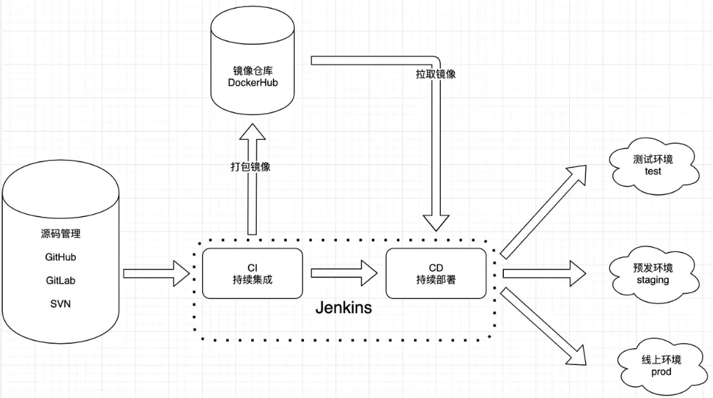
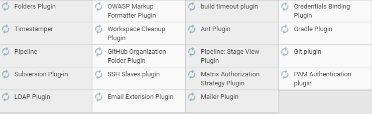
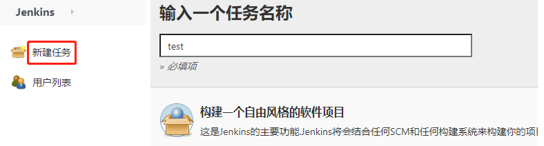
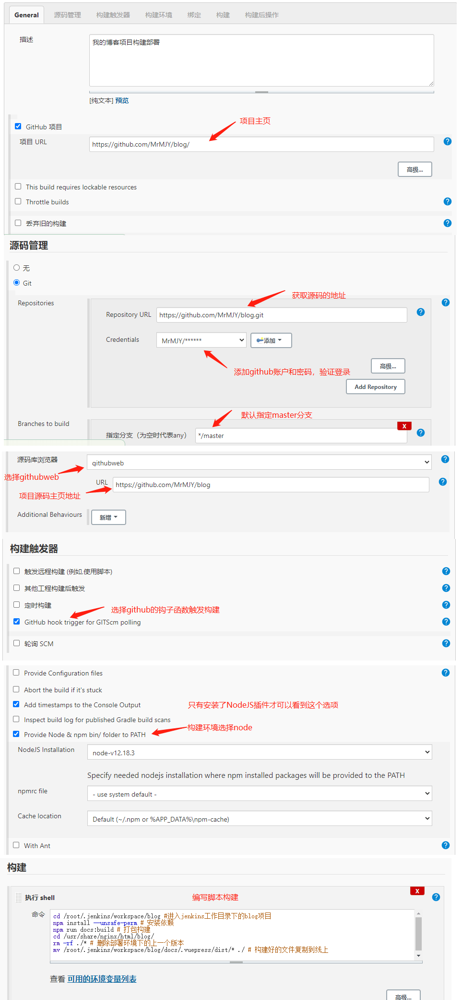

## 如何用 jenkins 构建部署项目


::: tip What is Jenkins?
Jenkins是开源 CI（Continuous Integration：持续集成）&CD（Continuous Delivery：持续交付） 软件领导者， 提供超过1000个插件来支持构建、部署、自动化， 满足任何项目的需要，支持各种运行方式，可通过系统包, Docker 或者通过一个独立的 Java 程序。
:::
### 示意图


### 为什么选择 Jenkins
+ <b>持续集成和持续交付：</b>作为一个可扩展的自动化服务器，Jenkins可以用作简单的CI服务器，或者变成任何项目的连续交付中心。
+ <b>简易安装：</b>Jenkins是一个独立的基于Java的程序，可以立即运行，包含Windows，Mac OS X和其他类Unix操作系统。
+ <b>配置简单：</b>Jenkins可以通过其网页界面轻松设置和配置，其中包括即时错误检查和内置帮助。
+ <b>插件：</b>通过更新中心中的1000多个插件，Jenkins集成了持续集成和持续交付工具链中几乎所有的工具。
+ <b>扩展：</b>Jenkins 可以通过其插件架构进行扩展，从而为 Jenkins 可以做的事提供几乎无限的可能性。
+ <b>分布式：</b>Jenkins可以轻松地在多台机器上分配工作，帮助更快速地跨多个平台推动构建，测试和部署。

## Jekins 安装
Jenkins是一个开源的软件项目，是基于java开发的一种持续集成工具，用于监控持续重复的工作，旨在提供一个开放易用的软件平台，使软件的持续集成变成可能。
### 需要一台虚拟机
VMware虚拟机、Linux系统(Ubuntu)

网上帖子一堆，这里不是重点
### 使用XShell工具操作虚拟机
使用XShell工具，连接Ubuntu

网上帖子一堆，这里不是重点
::: tip 踩到的坑
XShell登录的时候输入用户名，无法区分大写，例如登录名为`MJY`，XShell登录验证必须输入`mjy`，否则登录不了
:::
### 搭建Jenkins环境
#### 安装JDK
Jenkins是基于java开发的一种持续集成工具，所以需要JDK支持。
```js
// 查看apt库都有哪些jdk版本
apt-cache search java|grep jdk
// 选择版本进行安装
apt-get install openjdk-8-jdk
// 验证安装成功
java -version 
```
其他按照方式网上有很多
#### 安装Jenkins
[选择安装到Ubuntu](https://pkg.jenkins.io/debian-stable/)
```cmd
wget -q -O - https://pkg.jenkins.io/debian-stable/jenkins.io.key | sudo apt-key add -
deb https://pkg.jenkins.io/debian-stable binary/
sudo apt-get update
sudo apt-get install jenkins
```
#### 配置Jenkins
默认情况是Jenkins是使用Jenkins用户启动的，但这个用户目前系统并没有赋予权限，这里我们将启动用户修改为root；另外Jenkins默认端口是8080，这个跟tomcat的默认端口冲突，我们也修改一下默认端口。
```cmd
vi /etc/sysconfig/jenkins
# 将 JENKINS_USER="root"
# 将 JENKINS_PORT="8000"
```
#### 启动Jenkins
`sudo service jenkins start`

现在可以访问Linux上启动的Jenkins服务了，在windows浏览器中输入**192.168.0.104:8000**

登录密码在`/var/lib/jenkins/secrets/initialAdminPassword`中，

`cat /var/lib/jenkins/secrets/initialAdminPassword`复制密码登录

## Jekins 使用
### 修改插件镜像源
+ [Jenkins插件源使用国内镜像中心的最新方法](https://blog.csdn.net/weixin_40046357/article/details/104489497)
+ [更改插件源为国内源](https://www.cnblogs.com/poloyy/p/12785401.html)
### 安装常用(默认)插件

+ 汉化插件 **Localization: Chinese (Simplified)**
+ 参数化构建 **Git Parameter Plug-In**
+ 安装**Node Plugin**(起到Jenkins与Node环境之间的连接作用)
+ Git(管理代码)
+ GitHub

### 在服务器上搭建Node环境
+ 下载Node源码包，可以在window系统上下载Linux的[Node源码包](https://nodejs.org/dist/v12.18.3/node-v12.18.3-linux-x64.tar.xz)，也可以直接在Linux上直接下载。
+ 解压`xz -d node-v12.18.3-linux-x64.tar.xz`、`tar -xvf node-v12.18.3-linux-x64.tar`
+ 设置 nodejs 环境变量
```cmd
vim /etc/profile
#在文件中最下方添加
export NODE_HOME=/usr/maojinyu/software/node-v12.18.3-linux-x64
export PATH=$NODE_HOME/bin:$PATH
```
+ :wq保存并退出，编译/etc/profile 使配置生效
  `source /etc/profile`
+ 验证是否安装配置成功
  `node -v`
+ 安装**Node Plugin**(起到Jenkins与Node环境之间的连接作用)
+ 在Jenkins中配置Node路径
  + 系统管理 -> 全局工具配置 -> NodeJS
  

不同的系统安装软件的方式可能不同，根据自己的实际情况选择一种安装方式。例如：apt-get、wget

### 创建任务

### 配置任务

### 与代码仓库结合自动构建

### 构建后发送邮件执行shell脚本
