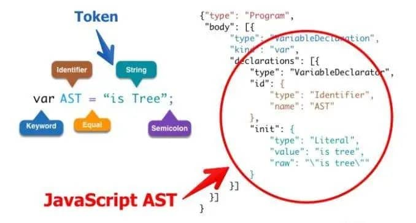
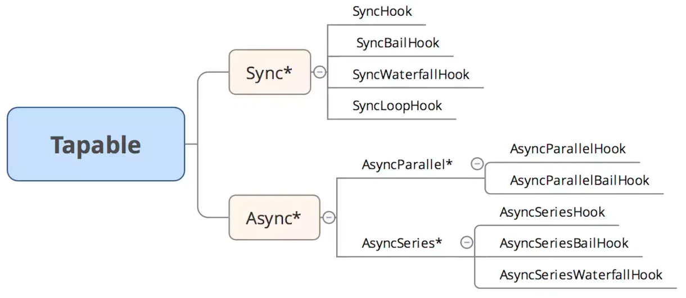

## 抽象语法树(Abstract Syntax Tree)
`Webpack`和`Lint`等很多工具和库的核心都是通过**Abstract Syntax Tree**抽象语法树这个概念来实现对代码的检查、分析等操作的。

### 抽象语法树的用途
+ 代码语法的检查、代码风格检查、代码格式化、代码高亮、代码错误提示、代码自动补全等等
  + 如`JSLint`、`JSHint`对代码错误或风格进行检查，发现潜在的错误
  + IDE的错误提示、格式化、高亮、自动补全等
+ 代码混淆压缩
  + UglifyJS2等
+ 优化变更代码，改变代码结构使代码结构达到想要的结构
  + 代码打包工具`webpack`、`rollup`等
  + CommonJS、AMD、CMD、UMD等代码规范之间的转换
  + TypeScript、JSX等转换为原生的JavaScript

### 抽象语法树定义
抽象语法树(AST)都是通过**JavaScript Parser**转化而来，这棵树定义了代码的结构，通过操作这棵树，我们可以精准的定位到声明语句、赋值语句、运算语句等，实现对代码的分析、优化、变更等操作。


### JavaScript Parser
+ **JavaScript Parser**是可以把js源码转化为抽象语法树的解析器。
+ 浏览器会把js源码通过解析器转换为抽象语法树，再进一步转换为字节码或直接生成机器码。
+ 一般来说每个js引擎都会有自己的抽象语法树格式，Chrome的V8引擎，Firefox的SpiderMonkey引擎等等，MDN提供了详细SpiderMonkey AST Format的详细说明，算是业界的标准。

#### 常用的JavaScript Parser
+ [esprima](https://esprima.readthedocs.io)
+ traceur
+ acorn
+ shift

#### esprima
+ 通过[esprima](https://esprima.readthedocs.io)把源码转换成AST
+ 通过[estraverse](https://github.com/estools/estraverse)遍历并更新AST
+ 通过[escodegen](https://github.com/estools/escodegen)将AST重新转换成源代码
+ [astexplorer](https://astexplorer.net/)在线转换工具

> 通过一个简单的`demo`，实现一个将源代码`getName`函数变成`getName_entry_leave`

```js
// src/index.js
const esprima = require('esprima')
const estraverse = require('estraverse')
const escodegen = require('escodegen')
const code = 'function getName() {}'
// esprima最新版本v4提供了两个API
// parseScript解析不包含import和export的脚本
// paserModule解析包含import和export的脚本
// API可传入3个参数，后两个非必填，返回的是AST 更多查看文档
let res = esprima.parseScript(code)
console.log(res)

// 遍历整个AST，每个节点都会执行进入和离开的回调函数，并且将这个节点作为参数传入
// API的配置对象还有更多的配置项，更多查看文档
estraverse.traverse(res, {
  enter(node) {
    console.log('entry', node.type)
    if (node.type == 'Identifier') node.name += '_entry'
  },
  leave(node) {
    console.log('leave', node.type)
    if (node.type == 'Identifier') node.name += '_leave'
  }
})
res = escodegen.generate(res)
console.log(res) // function getName_entry_leave() {}
```
```js
// ast
Script {
  type: 'Program',
  body: [
    FunctionDeclaration {
      type: 'FunctionDeclaration', // 函数声明
      id: [Identifier] { type: 'Identifier', name: 'getName' }, // 函数名
      params: [], // 形参
      body: [BlockStatement] { type: 'BlockStatement', body: [...] }, // 函数体
      generator: false, // 是否是 generator 函数
      expression: false, // 是否是函数表达式
      async: false // 是否是 async 函数
    }
  ],
  sourceType: 'script'
}
```
### Babel
可以通过`esprima`、`estraverse`、`escodegen`三个包实现，源码->AST->输出的过程。但是比较麻烦，而且在转换的过程中需要自己去针对不同的语法做不通的转换，很不方便。

`Babel`作为转换`JavaScript`的常用工具，提供了丰富的插件，以及转换的类型，借助`Babel`可以快速的实现自己想要的功能。

#### Babel核心
`Babel`的核心包：[@babel/core](https://babeljs.io/docs/en/)、[@babel/types](https://babeljs.io/docs/en/babel-types)(v7版本)。`@babel/core`作为主线程序，宏观上控制着**解析（parse），转换（transform），生成（generate）**，`@babel/types`是一个用于 AST 节点的 Lodash 式工具库，它包含了构造、验证以及变换 AST 节点的方法。

#### 使用babel转换箭头函数
```js
const babel = require('@babel/core')
const types = require('@babel/types')
const code = 'let getSum = (a, b) => a + b'
// 想要的结果 var getSum = function(a, b) { return a + b }

// 自定义的转换箭头函数的插件
const myPlugin = {
  visitor: {
    // 定义变量
    VariableDeclaration({ node }) {
      if (node.kind == 'let' || node.kind == 'const') node.kind = 'var'
    },
    // 箭头函数
    ArrowFunctionExpression(path) {
      let { node } = path
      let body = node.body
      
      // 如果一个函数的函数体是一个2进制表达式，直接返回表达式结果
      if (types.isBinaryExpression(node.body)) {
        body = types.blockStatement([types.returnStatement(node.body)])
      }
      // types.functionExpression(id, params, body, generator, async)
      path.replaceWith(types.functionExpression(null, node.params, body, node.generator, node.async))
    }
  }
}

// babel.transform(code: string, options?: Object, callback: Function)
// 关于babel的更多API请查看手册
const options = {
  ast: true, // 返回AST
  plugins: [
    myPlugin
  ]
}
// ast包含很多内容，包括类型，代码范围，注释等等，最主要的是node、body，包含了节点的关键AST描述
const result = babel.transform(code, options)
console.log(result.code)
```

#### Babel手册(强烈推荐)
以下文章不是针对最新版本的 Babel 的，但是原理是相同的，可以作为很好的入门资料。
+ [Babel 插件手册](https://github.com/jamiebuilds/babel-handbook/blob/master/translations/zh-Hans/plugin-handbook.md#toc-asts)
+ [Babel 用户手册](https://github.com/jamiebuilds/babel-handbook/blob/master/translations/zh-Hans/user-handbook.md)

## [Tapable](https://github.com/webpack/tapable/tree/v2.0.0)
**Tapable** 是一个类似于`Node.js`中的`EventEmitter`的**库**，但更专注于自定义事件的触发和处理。`webpack`通过`tapable`将实现与流程解耦，所有具体实现通过插件的形式存在。

`webpack`本质上是一种事件流的机制，它的工作流程就是将各个插件串联起来，而实现这一切的核心就是`Tapable`，`webpack`中最核心的负责编译的`Compiler`和负责创建`bundles`的`Compilation`都是`Tapable`的实例。

### Hooks概览
`tapable`包暴露出很多钩子类，这些类可以用来为插件创建钩子函数，主要包含以下几种
```js
const {
	SyncHook,
	SyncBailHook,
	SyncWaterfallHook,
	SyncLoopHook,
	AsyncParallelHook,
	AsyncParallelBailHook,
	AsyncSeriesHook,
	AsyncSeriesBailHook,
	AsyncSeriesWaterfallHook
 } = require("tapable");
```
所有钩子类的构造函数都接收一个可选的参数，这个参数是一个**由字符串参数组成的数组**，如下：
```js
const hook = new SyncHook(["arg1", "arg2", "arg3"]);
```
常用的钩子主要包含以下几种，分为**同步**和**异步**，异步又分为**并发执行**和**串行执行**


|钩子名称|执行方式|说明|
|---|---|---|---|
|SyncHook|同步串行|不关心监听函数的返回值|
|SyncBailHook|同步串行|只要监听的函数中有一个函数的返回值不为`undefined`，则跳过剩下所有的逻辑|
|SyncWaterfallHook|同步串行|上一个监听函数的返回值可以传给下一个监听函数|
|SyncLoopHook|同步循环|当监听函数被触发的时候，如果该监听函数返回`true`时则这个监听函数会反复执行，如果返回`undefined`则表示退出循环|
|AsyncParallelHook|异步并发|不关心监听函数的返回值|
|AsyncParallelBailHook|异步并发|只要监听函数的返回值不为`null`，就会忽略后面的监听函数执行，直接跳跃到`callAsync`等触发函数绑定的回调函数，然后执行这个被绑定的回调函数|
|AsyncSeriesHook|异步串行|不关心`callback()`的参数|
|AsyncSeriesBailHook|异步串行|`callback()`的参数不为`null`，就会直接执行`callAsync`等触发函数绑定的回调函数|
|AsyncSeriesWaterfallHook|异步串行|上一个监听函数的中的`callback(err, data)`的第二个参数,可以作为下一个监听函数的参数|

### 使用
**SyncHook**
```js
const queue = new SyncHook(['arg1', 'arg2'])

// 简单实现
// class SyncHook {
//   constructor() {
//     this.hooks = []
//   }

//   tap(name, fn) {
//     this.hooks.push(fn)
//   }

//   call() {
//     this.hooks.forEach(hook => hook(...arguments))
//   }
// }

queue.tap('name', function(arg1, arg2) {
  console.log('name', arg1, arg2)
})

queue.tap('age', function(arg1, arg2) {
  console.log('age', arg1, arg2)
})

queue.tap('sex', function(arg1, arg2) {
  console.log('sex', arg1, arg2)
})

queue.call('webpack', 'webpack-cli')
// name webpack webpack-cli
// age webpack webpack-cli
// sex webpack webpack-cli
```